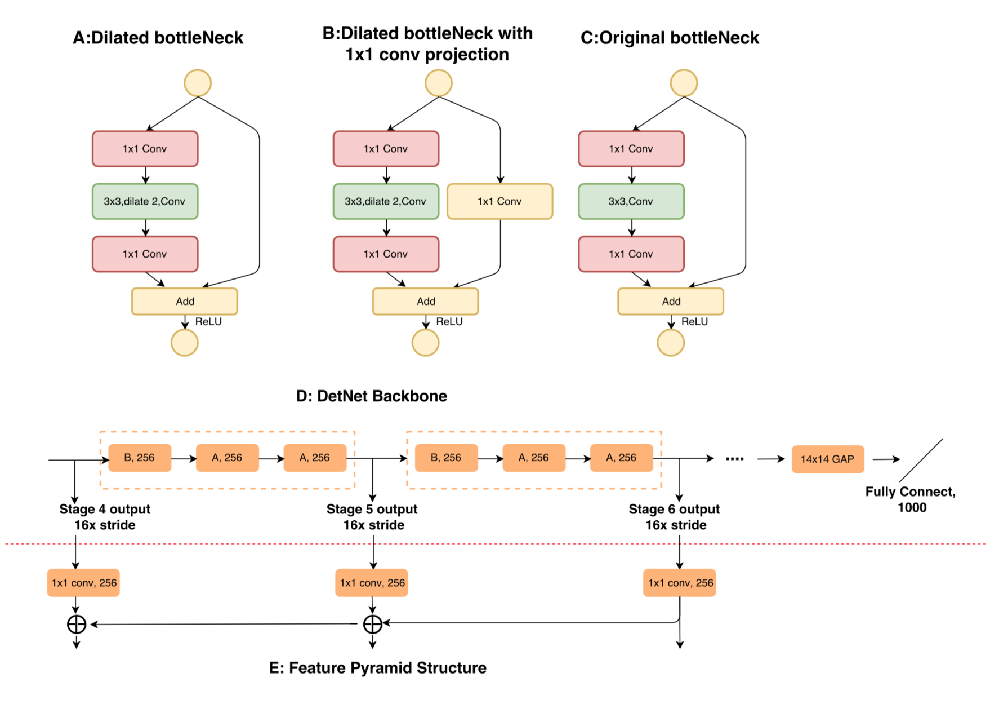
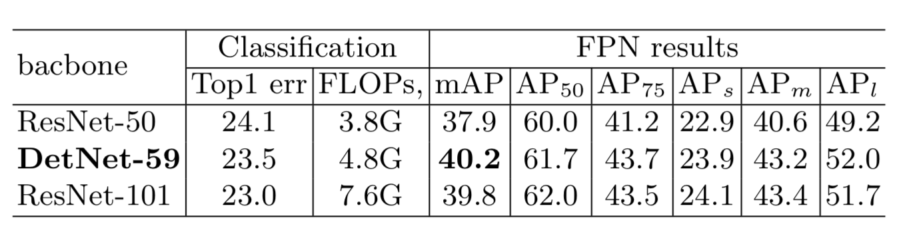

# DetNet

DetNet是一种专为目标检测任务设计的backbone。

## 关注点

- 如何减少计算量（为保持分辨率不变）
- 如何同时保证图像分辨率和足够大的感受野

## 传统backbone的问题

- 网络层数不固定

    传统的网络可能包含5个stage，即32倍上采样，用于检测的backbone在传统网络的基础上加深。FPN为了进一步识别大物体，增加了P6层；RetinaNet又在基础上增加了P7层。显然后加入层没有前几层在ImageNet上进行预训练。

- 对大物体可见度差

    为了识别大物体，提高感受野，一般采用较深的特征层。而这些层会导致边缘信息损失，定位准确度下降。这种情况会随着特征层的加深而不断严重。

- 对小物体不可见

    当分辨率降低到一定程度时，小物体会直接丢失，或信息不足以辨认。一般的方法是在较低的特征层去识别小物体，但由于这些层一般表现力不足，无法胜任定位的工作。FPN采用的方法是自下而上，将较高层的特征图叠加进来，但若小物体在高层已经消失，在传递回高分辨率的过程中仍无法有效使用。

## 网络结构

首先是对标准的bottleNeck进行了改进，用扩展率为2的空洞卷积代替中间的标准卷积，以此提高感受野（以代替各层之间的maxpooling），并保持原图分辨率不变。同时，为了控制计算量，不再逐stage增加通道数，保持在256channel。

## 实验结果

在数据量没有明显增加的情况下，检测和回归任务的精度均有提升，尤其在小物体检测上效果明显。最终测试结果高于ResNet50，近似于ResNet101。

在小物体和大物体检测中，均取得比ResNet更好地结果。

