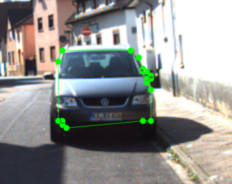
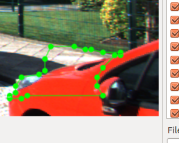
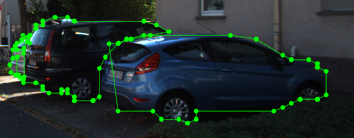

# Mask + Poly
## 2018.11.13
- 从 Mask 网络传入的 RoI 直接输入给 Poly ，会导致预测结果性能差。分析原因为 RoI 给定的区域太小，导致 Poly 在有限的视野下， 把很多 foreground 当成了 background。目前想到的方案是手动扩大 RoI 范围，加入 exp 参数，扩大固定像素点的视野。

未扩大 RoI 的输出结果

### exp 参数的确定
目前还没有解决该问题，采用设定 exp=15,这样会导致的问题很多：
1. 某些物体本身就不大，加入太多的 background pixel 会导致 poly 结果不好。 
2. 在图片边缘时，无法有效扩展，导致边缘物体的检测结果一直不好 

边缘处性能差

3. 在扩大pix之后，两个相邻的同类物体会出现在一个 RoI 中，导致分辨能力下降，把多个同类物体归为一类。

相邻同类物体检测

### 优化思路
1. 更换 exp 的生成策略，按 RoI 区域大小以一定比例缩放
2. 加入 Mask 信息，用 Mask 弥补局部检测性能差的问题
3. 点个数优化， 目前生成的点有点太密了，可能不利于人的操作

