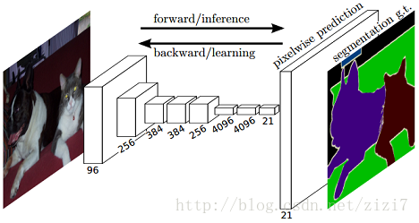
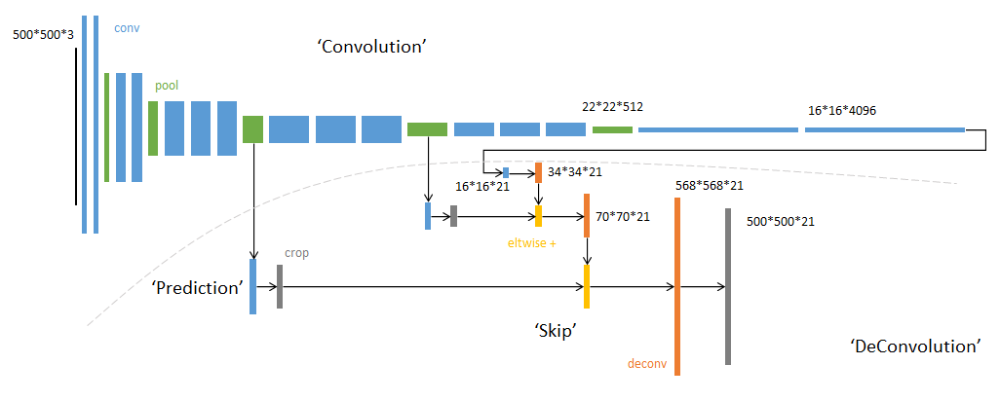
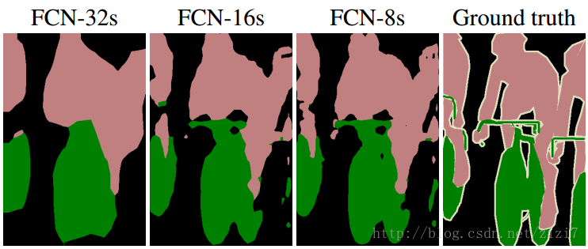
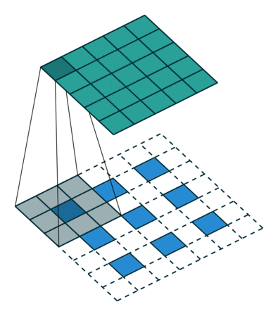
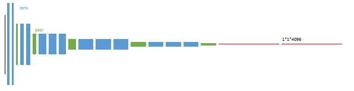
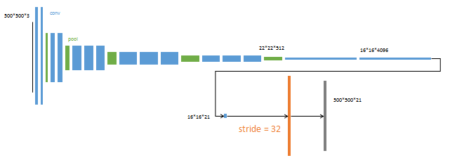
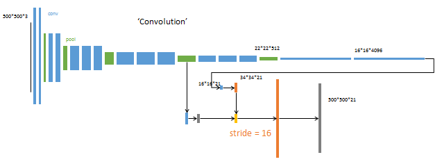
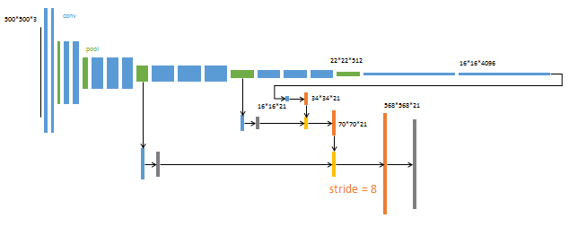

# FCN
该方法由 Berkeley 团队提出， 用 Fully Convolutional Network 方法进行语义分割，扩展到像素级。

##FCN原理
将传统网络后面的全连接层替换为卷基层。通过 maxpooling 将原图片分别缩小 8 / 16 / 32 倍，然后在通过反卷积依次放大各个结果，得到 568x568x21 的结果，并进行缩小。其中，21个通道表示 Pacvol 数据集的 20 个类型 + background，若使用不同的数据集需要根据情况更改设置。

**用卷积层代替全连接层**
对于 AlexNet，若输出的 feature map 为 7x7x256，则可以使用 7x7x256x4096的卷积层来代替全连接层，输出结果同样为 1x1x4096 。一般来说，用卷积层进行操作可以节省运算时间，但是其效果相对与全连接层仍较差，由于稀疏化的表示会导致部分信息的丢失，但在这里我们认为使用卷积层和全连接层具有近似相同的效果，却可以大大提升计算和训练的速度，达到实时。

**逐像素的分类预测**
使用反卷积对最后一个卷积层的 feature map 进行上采样，使其恢复到与输入图像相同的尺寸，从而实现对每个像素的预测，并在空间上保留对应的信息。最终对每个像素点的所有通道求最大值，作为预测的最终结果。单纯使用最后一层 pooling 进行分割结果不够精细，因此综合了最后三次 pooling 产生的 feature map 。

**反卷积操作**
反卷积指通过求卷积的转制矩阵，而复原卷积操作的过程。这里使用的反卷积并不是标准的卷积，而是一种卷积操作的变种。即先通过加入空白的元素扩充 feature map， 再使用卷积操作，起到扩展图片大小的效果。这里以 3x3 的输入为例，先扩充为 7x7 ，再用 3x3 的卷积核进行卷积，得到 5x5 的输出。

## 训练过程
第一阶段：建立经典网络进行训练，最后两层作为全连接，之后删除。

第二阶段：从特征图 16x16x4096 预测分割图 16x16x21，直接升采样至标准图。反卷积布长为32，称该网络为 FCN-32s。

第三阶段：对倒数第二次 pooling 的结果融合进来，进行两次反卷积，称为 FCN-16s

第四阶段：进一步融合第三次 pooling 的结果，称为 FCN-8s

