# Faster Rcnn
参考：[机器学习随笔](https://zhuanlan.zhihu.com/p/31426458)

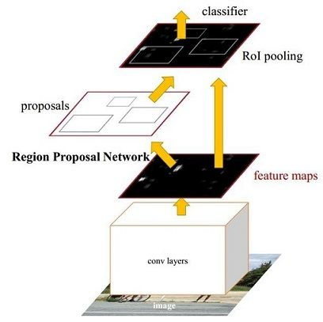

Faster Rcnn 包括4个主要部分
1. **Conv layers**：原文中使用的是FZ Net，可替换为其他主流网络的conv层
2. **Region Proposal Networks**：RPN网络生成region proposals。通过softmax判断anchors属于foreground或background，利用 bounding box regression 修正 anchors 获得精确的 proposals。
3.  **Roi Pooling**：该层收集输入的 feature maps 和 proposal 的类别，同时再次 bounding box regression 修正 anchors 获得精确的 proposals 。
4. **Classification**：利用 proposal feature maps 计算 proposal 的类型，并再次使用 bounding box regression 获得最终的精确 bounding box 。

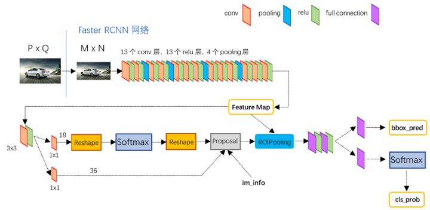 

##Conv layers
13个 conv 层，13个 relu 层， 4个 pooling 层。具有如下特点：
1. 所有的 conv 层都是：kernel_size = 3, pad = 1, stride = 1，图片大小不变
2. 所有的 pooling 层都是：kernel_size = 1, pad = 0, stride = 2，图片大小减半
最终，一个 MxN的图片变为 (M/16)x(N/16)，Conv layers 生成的 feature map都可以和原图对应起来

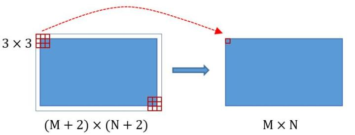

## Region Proposal Networks
**生成anchors -> softmax分类提取fg anchors -> bbox reg回归fg anchors -> Proporsal Layer生成proposals**

直接使用 RPN 生成检测框，极大地提高检测框的生成速度。网络分为两条线，一条通过 softmax 分类 anchors 获得 foreground 和 background， 下面一条计算用于计算机对 anchors 的 bounding box regression 的偏移量，以获得精确的 proporsal。最后的 Proposal 层负责综合 foreground anchors and bounding box regression 偏移量获取 proposals

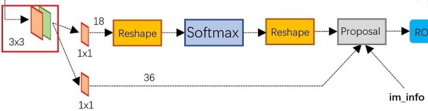

在生成 anchors 的过程中，对每个点生成9个不同形状的 anchors。生成的 9x4 矩阵代表各 anchors 的四个顶点位置。这样生成的 bounding box 并不准确，但是可以通过后续的2次 regression 进行修正。

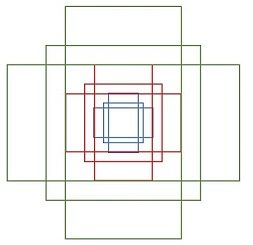

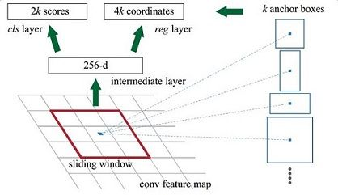

上图的256代表 conv 层的最后输出层数，若替换为Vgg16, 则为512, 其他网络则替换为其他部分。在 conv 层之后又进行了一次 3x3 的卷寄操作，且 n_output 不变，可理解为融合周围 3x3 的信息，提高稳定性。 每个点上有k个 anchor ， 则 cls 分为 foreground 和 background，共2k个；每个 anchor 对应 [x，y，w，h]四个偏移量， reg 层有4k个参数

** softmax 判断 foreground 和 background **

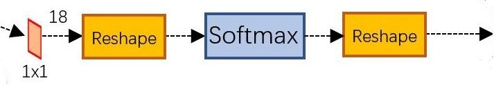

对于RPN输入的 feature map，其尺寸为WxH， 先进行1x1卷积，输出层为 9x2 = 18，对应于 feature map 中的 9 个 anchors 和 background / foreground 2类。因此将信息保存为 W x H x 18，用来进行softmax分类。前后的 Reshape 都是为 caffe 服务，在实际使用中可以根据实际运算情况进行调整。

** bounding box regression 原理 **

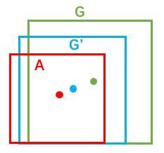

一般的，每个窗口使用 (x, y, w, h) 四个参数进行标识，在图片中，A代表原始的 Foreground Anchors，G代表目标的 bounding box，因此需想办法设计一个从  A 到 G 的关系，使 A 往 G' 的方向不断发展。

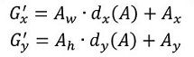

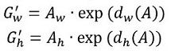

通过调整中心位置和缩放的方式，共有四个变换形式，建立线性回归模型对预测框进行微调，只有在微调时可以看作是线性的回归模型，否则需要转化为复杂的非线性问题。

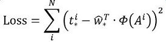

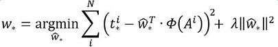

RGN Loss Function

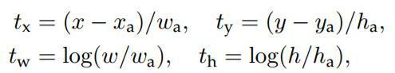

** 对 proposals 进行的 bounding box regression **

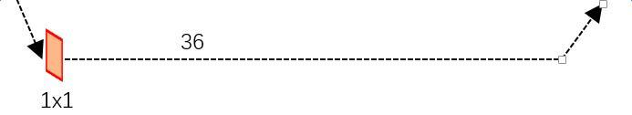

由上节，num_out = 4 * 9 = 36，存储为 [1, 36, H, W]

** Proposal Layer**
Proposal Layer 负责综合四个 bounding box 变换量和 foreground  anchors，计算出精确的 proposal，送入后续的 RoI Pooling Layer。
Proposal layer 有三个输入：fg/bg anchors 分类器的结果 rpn_cls_prob_reshape, bbox reg 的四个变换量 rpn_bbox_pred，以及 im_info。另外还有一个参数 feat_stride=16。
**im_info**：对任意大小 PxQ 的图片，在传入时首先要 reshape 到固定的 MxN，im_info = [M, N, scale_factor] 保存缩放的信息。经过 Conv Layers 的缩放，变为 (M/16)x(N/16)，feature_stride = 16 保存了 Pooling 缩放的信息。
**处理过程**： 
1. 生成 anchors， 对 anchors 做 bbox regression
2. 按照 foreground softmax scores 有大到小排序 anchors， 提取前 pre_nums_topN（6000）个 anchors。
3. 限定超出图形边界的 foreground anchors 为图像边界
4. 去除非常小的 foreground anchors
5. 进行 nunmaximum suppression（非极大值抑制），去除同一个物体冗余的 bbox。对于有重叠的候选框，若大于规定的阈值则删除，低于阈值保留。无重叠的都保留。
6. 再次对 nums 后的 foreground softmax scores 有大到小排序 fg anchors，提取前 post_nms_topN（300）结果作为 proposal 输出。

### RoI Pooling
输入为原始的 feature map 和 proposal boxes， 计算出 proposal feature maps。

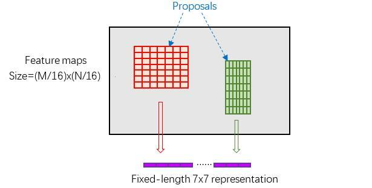

由于给出的 proposal boxes 的形状并不相同，不能直接放入网络中训练，因此需要转化为固定的尺寸。
PoI Pooling 的方法是根据设定的 w，h 将原图片划分为 w x h 份， 每一份中进行 max pooling。这样输入被转化为了 w x h 的标准大小。

### Classification
通过full connect 和 softmax 计算每个 proposal 属于的类别，输出 cls_prob；再利用 bbox regression 获得位移片量 bbox_pred, 用于更精确的回归。

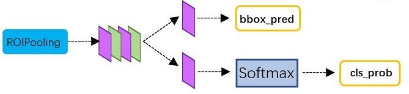

### Faster RCNN训练
Faster RCNN 在已经训练好的 model 的基础上继续进行的训练。
1. 在已经训练好的 model 上，训练 RPN 网络
2. 利用 RPN 网络收集 proposals
3. 第一次训练 Fast RCNN
4. 第二次训练 RPN 网络
5. 利用4训练好的新 RPN 收集 proposals
6. 第二次训练 Fast RCNN

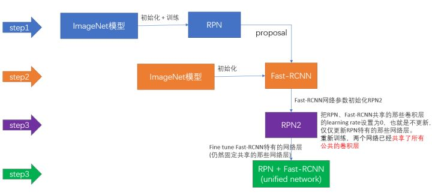

此外，还可以用 end-to-end 的方法训练 Faster RCNN。