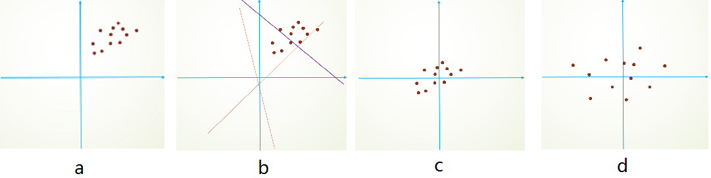

# Normalization

常用的Normalization方法可分为：Batch Norm、Layer Norm、Weight Norm等，用于对不同的目标集合S进行规范化。

## Mini-Batch SGD 与 Batch Normalization

Normalization问题的出现基于Mini-Batch SGD的广泛使用。在训练网络时，每次更新前需要根据当前batch下的所有训练个体的网络输出，确定参数的更新方向。这样得到的更新方向更准确，并行计算速度快。

根据已知的经验，batch size越小，训练出的网络泛化能力越好。Batch size大小对系统能力的影响是多方面的，首先过大的batch size会使得模型只会向较少的方向学习，降低泛化能力；另一方面，由于batch内的个体可能分布不均衡，导致学习效率低下，整个网络更难训练。

### covariate shift

深度网络的训练基于IID假设：假设测试数据和训练数据满足独立同分布的。Covariate shift指如果系统的输入X分布经常变化，不符合IID假设，则网络很难训练和收敛。

Internal Convariate Shift指出此现象不仅发生在输入层，而在深层网络的隐藏层中，由于上层网络的迭代和更新，下层的输入分布会不断变化，很难稳定学习。因此更深的网络需要使用小学习率，防止下层网络过于震荡。

对数据进行归一化，可以去除数据之间的相关性， 突出分布的相对差异，并加速训练过程。

### Batch Normalization

BN的基本思想是：深层网络随着每层输出随着层数增加和训练。分布逐渐发生偏移，整体分布趋向上下极端，进入非线性激活函数的死区，反向传播时低层网络梯度消失。BN则通过规范化，使得每层的输入回到均值0方差1的标准正态分布，使得数据落入激活函数性能较好的区域，找回消失的梯度。

