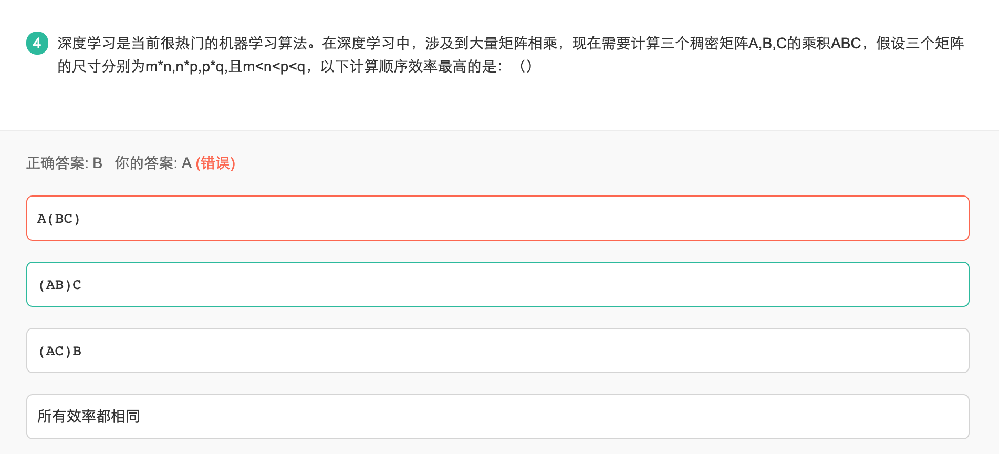
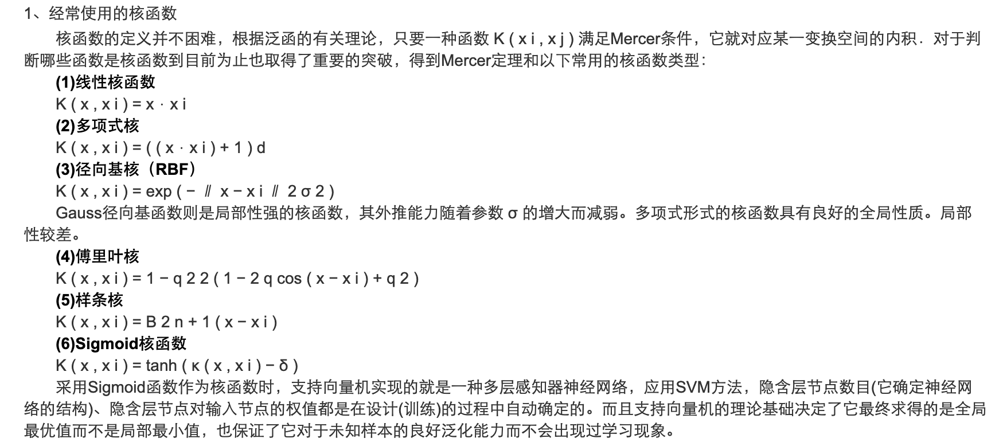
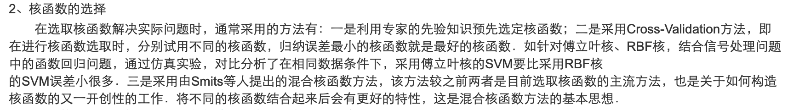

# 牛客刷题笔记

## 机器学习面试

### 2019.3.5

 

对于两个矩阵A (m * n)、B (n * p)，其计算量为 m * p * n

 

#### 生成模型和判断模型的划分
生成模型和判断模型是对分类器的常用分类方式，主要区别在于：
- 生成模型估计联合分布 P(X,Y)
- 判断模型估计判别函数 F(x) 或 条件概率分布 P(Y|X)

可以看出，已知生成模型，可以通过贝叶斯原理得出判别模型，而反之则不行

常见的生成模型和判别模型
1. 生成模型：
    - 判别式分析
    - 朴素贝叶斯
    - 混合高斯型
    - K近邻
    - 隐马尔科夫模型
    - 贝叶斯网络
    - sigmoid belief network
    - 马尔科夫随机场
    - 深度新年网络
    - 多专家模型
2. 判别模型：
    - 线性回归
    - 逻辑回归
    - 神经网络
    - 支持向量机
    - 高斯过程
    - 条件随机场
    - CART
    - Boosting

