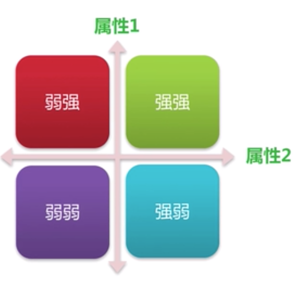

# 竞品分析

## 【教学】腾讯产品总监：竞品分析四部曲 [link](https://www.bilibili.com/video/av26372735/?spm_id_from=333.788.videocard.0)

心理学在产品设计中具有重要参考价值。

### 什么是竞品分析

#### 定义

- 竞品：竞争的产品，竞争对手的产品
- 竞品分析： 对精真估敌手的产品进行比较和分析

#### 为什么要做竞品分析

- 知己知彼：了解和对手的优劣、
- 以彼之道 还施彼身：利用对手的运营手段和策略，进行反击
- 化为己用：吸收对方的有点

#### 竞品的分级

- 直接竞争：市场目标方向一致，客户群体针对性强，产品功能和用户相似度极高的产品，如新浪微博vs腾讯微博
- 间接竞争：功能需求互补的产品，用户群体高度重合，目前不构成直接竞争，但未来可能成为潜在竞争关系，如QQ秀vsQQ游戏秀
- 行业领先者/异业竞争者：其他相关领域的优秀企业、头部企业（bat），有能力从其他领域杀入，形成竞争

### 竞品分析方法和步骤

- 明确背景目标
- 找到竞争对手
- 产品定位分析
- 产品设计分析
- 竞争策略分析
- 竞品数据分析

#### 明确背景目的

- 常见目的
  - 了解市场发展行情
  - 了解和竞品的差距
  - 确认新的产品切入点
  - 提升和改进产品
  - 更好地占领市场

- 其他目的
  - 决定功能特性取舍：从其他已有竞品确定功能取舍
  - 产品商业拓展估计：看已有的产品商业模式是否合理
  - 改进产品体验设计

- 主要内容
  - 竞品在行业内的地位
  - 行业方向如何
  - 产品发展方向
  - 竞品优势劣势

- 注意事项
  - 确定分析报告为谁而做（产品/研发/设计/运营/老板）
  - 着重要分析哪些内容
  - 报告能带来哪些有价值的结论和建议：报告一定要有结论!

#### 找到竞争对手

- 如何找到
  - 浏览资讯
  - 人脉资源
  - 头脑风暴

- 需要哪些信息
  - 公司技术、产品、市场、运营团队的规模及核心目标和行业品牌影响力
  - 季度年度盈利值、各条产品线资金投入信息；占据公司主盈利的产品线
  - 用于群体的覆盖面、市场占有率、运营盈利模式；固定周期的总注册用户（体量）
  - 产品功能细分与对比；稳定性、易用性、用户体验交互、视觉设计实力、技术实现框架优劣势
  - 产品平台及官方的排名和关键字

- 如何寻找
  - 公司内部收集
  - 行业媒体、搜索引擎（weixin.sougou.com）、专利网站（新专利预示着新的方向和产品）
  - 建立持续的产品信息收集小组
  - 调查核心用户、活跃用户、普通用户的应用习惯
  - 对手官网、动态新闻、历史更新版本
  - 对手季度/年度财报
  - 对手招募人才方向、是否人才流失
  - 试用国外同行业先进产品
  - 试用对方产品、客服咨询

#### 产品定位分析

- 用户定位：用户与需求
  - 功能
    - 产品存在的核心价值
    - 解决用户的问题
    - 如何比别的产品更好
  - 内容
    - 内容深度、新颖、更新速度
  - 社交
    - 社交关系在产品中的沉淀
    - 弱关系和强关系
  - 情感
    - 对产品的习惯性
    - 生活方式的改变

```markdown
KANO模型分析法

用户对产品的需求可分为三类：基本型、期望型、兴奋型

- 基本型：必须具备的基本功能。用户不说也必须提供的
- 期望型：用户可以较明确提出的需求
- 兴奋型：超出期望的，用户自己也不知道，但用起来很爽的功能

基本型满足，用户会使用产品；期望型满足
```

- 市场定位

```markdown
四象限分析法

定义：将两个主要指标作为依据进行分类，进行分类关联分析，分析解决问题。

基本原则：找到一个事物的两个重要属性
```

<div align=center>

</div>

定义：将事物的两个重要属性作为分析的依据，进行分类关联分析

#### 产品设计分析

- 产品形态
  - 硬件软件：是否软硬结合（硬件+软件服务）
  - 终端类型：Phone/PC/Mac或其他设备
  - 技术类型：是原生APP/WebAPP还是微信公众号
- 逻辑和信息架构
  - 信息架构：产品呈现的信息层次，主要功能
  - 流程设计
  - 布局规划
- 产品功能：用户如何使用产品，是对信息结构和流程的具体体现
  - 比较研究法：设定目标，将同类功能模块或外观细节编组，分析比较结果
  - Yes/No法：将功能罗列，对多个产品是否有此功能给出Yes/No
  - 评分法
- 交互设计评估：尼尔森十大交互原则
  - 状态可感知
  - 贴近用户认知
  - 操作可控
  - 一致性
  - 防错
  - 再认好过会议
  - 灵活高效
  - 易扫
  - 容错
  - 人性化帮助
- 视觉评估：通过对文字、符号、图像的意义达到视觉和谐，3F原理  
  - From：审美层，好不好看，颜色是否和谐，字体搭配合理
  - Feeling：是否传递了意图信息，传递的信息是否统一，引起用户情感共鸣
  - Function：是否满足设计目的，是否易于理解
- 用户体验估计
  - 表现层：感知设计
  - 框架层：界面设计 + 导航设计
  - 结构层：交互设计 + 信息架构
  - 范围层：功能规范 + 内容需求
  - 战略层：产品目标与用户追求

TIP：表格最好给出优先级 《设计中的设计》 《用户体验要素》

#### 核心策略分析

- 商业模式分析
  - 商业模式
    - 投资人
    - 广告：流量变现
    - ToB：开放API/数据变现
    - 电商：售卖服务，实体或虚拟产品
    - ToC：增值服务，如会员、特权等
- 运营营销策略：运营是做出差异化的重要手段
  - 运营模式：内容/用户/活动/数据等方面的运营点
  - 渠道资源：渠道资源如何，渠道效率
  - 营销策略：策略方式的效果
  - 重要活动：活动案例、效果评估
- 公司战略分析：核心战略一般不可见，可从版本迭代挖掘

TIP：精益画布

#### 竞品数据分析

- 数据的获取
  - 需要哪些数据
    - 产品流量
    - 用户数据
    - 盈利数据
    - 市场占有
  - 如何获取
    - 官方发布
    - 调研反馈
    - 挖掘推算
- 数据的应用

### 竞品分析案例
