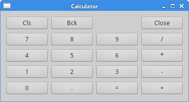
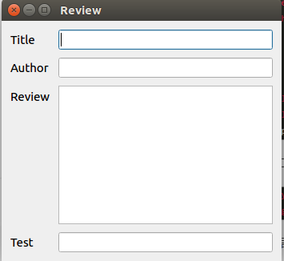

# PyQt5
PyQt5 是一套 Python 绑定 Digia QT5 应用的框架，可用于 Python2 和 Python3 。

## 常用结构
```
QLineEdit()

```

## 基本用法
### 定义基本部件
包括创建一个应程序对象 app ，和一个对于用户对象的基类

```
import sys
from PyQt5.QtWidgets import QApplication, QWidget

if __name__ == '__main__':
    # First Step: Create an object for PyQt5 App. sys.argv is a list to input parameters from Command line
    app = QApplication(sys.argv)
    # QWidget部件是pyqt5所有用户界面对象的基类。他为QWidget提供默认构造函数。默认构造函数没有父类。
    w = QWidget()
    # set up the size of window. Here we use 250px x 150px
    w.resize(250, 150)
    # move the window we create in screen.
    w.move(600, 300)
    # set up the title
    w.setWindowTitle('Simple')
    w.show()

    # 系统exit()方法确保应用程序干净的退出
    # exec_()方法有下划线。因为执行是一个Python关键词。因此用exec_()代替
    sys.exit(app.exec_())
```
### 修改默认图标
使用 setWindowsIcon 设置默认图标 。可以通过定义 class 的 init 初始化窗口设置
```
# -*- coding: utf-8 -*-

import sys
from PyQt5.QtWidgets import QApplication, QWidget
from PyQt5.QtGui import QIcon


class Example(QWidget):
    def __init__(self):
        super().__init__()
        # 界面绘制交给 InitUI
        self.initUI()

    def initUI(self):
        # 设置窗口的位置和大小
        self.setGeometry(300, 300, 300, 220)
        self.setWindowTitle('Icon')
        # 设置窗口图标为本目录下的文件 a.png
        self.setWindowIcon(QIcon('a.png'))

        self.show()


if __name__ == '__main__':
    app = QApplication(sys.argv)
    ex = Example()
    sys.exit(app.exec_())
    
```
### 输入提示语
使用 setToolTip 设置提示语，当鼠标长时间停留时出现
```
# -*- coding: utf-8 -*-

import sys
from PyQt5.QtWidgets import QApplication, QWidget, QToolTip, QPushButton
from PyQt5.QtGui import QFont


class Example(QWidget):
    def __init__(self):
        super().__init__()

        self.initUI()

    def initUI(self):
        # set up the Font setting including Font and size
        QToolTip.setFont(QFont('SansSerif', 10))
        # use setToolTip create a tip for the whole window
        self.setToolTip('This is a <b>QWidget</b> widget')

        btn = QPushButton('Button', self)
        btn.setToolTip('This is a <b>QPushButton</b> widget')
        # sizeHint
        btn.resize(btn.sizeHint())
        btn.move(50, 50)

        self.setGeometry(300, 300, 300, 200)
        self.setWindowTitle('Tooltips')
        self.show()


if __name__ == '__main__':
    app = QApplication(sys.argv)
    ex = Example()
    sys.exit(app.exec_())

```
### 用按钮退出
使用 QtCore 中的` QCoreApplication.intstance().quit ` 实现按键的退出功能
```
# -*- coding: utf-8 -*-

import sys
from PyQt5.QtWidgets import QApplication, QWidget, QPushButton
from PyQt5.QtCore import QCoreApplication


class Example(QWidget):
    def __init__(self):
        super().__init__()

        self.initUI()

    def initUI(self):

        qbtn = QPushButton('Quit', self)
        qbtn.clicked.connect(QCoreApplication.instance().quit)
        qbtn.resize(qbtn.sizeHint())
        qbtn.move(50, 50)

        self.setGeometry(300, 300, 300, 200)
        self.setWindowTitle('Quit button')
        self.show()


if __name__ == '__main__':
    app = QApplication(sys.argv)
    ex = Example()
    sys.exit(app.exec_())
```

### 在退出时弹出确认提示框
当退出程序时，会首先弹出提示框用于确认是否退出。注意必须将函数命名为 closeEvent 才会生效

```
# -*- coding: utf-8 -*-

import sys
from PyQt5.QtWidgets import QApplication, QWidget, QMessageBox


class Example(QWidget):
    def __init__(self):
        super().__init__()

        self.initUI()

    def initUI(self):

        self.setGeometry(300, 300, 300, 200)
        self.setWindowTitle('Message box')
        self.show()

    # It will appear when closing only when you def it with name closeEvent 
    def closeEvent(self, event):

        reply = QMessageBox.question(self, 'Message', 'Are you sure to quit?', QMessageBox.Yes | QMessageBox.No, QMessageBox.No)

        if reply == QMessageBox.Yes:
            event.accept()

        else:
            event.ignore()


if __name__ == '__main__':
    app = QApplication(sys.argv)
    ex = Example()
    sys.exit(app.exec_()) 
    
```

### 居中到屏幕中央
使用 QDesktopWidget 获取屏幕的中心位置，然后 move 程序框

```
# -*- coding: utf-8 -*-

import sys
from PyQt5.QtWidgets import QApplication, QWidget, QDesktopWidget


class Example(QWidget):
    def __init__(self):
        super().__init__()

        self.initUI()

    def initUI(self):

        self.resize(250, 150)
        self.center()

        self.setWindowTitle('Center')
        self.show()

    def center(self):

        qr = self.frameGeometry()
        cp = QDesktopWidget().availableGeometry().center()
        qr.moveCenter(cp)
        self.move(qr.topLeft())


if __name__ == '__main__':
    app = QApplication(sys.argv)
    ex = Example()
    sys.exit(app.exec_())

```

## 布局管理
PyQt5 的布局分为两种 ：绝对布局和布局类

### 绝对布局
使用 move() 来直接将相应的组件移动到需要的位置
```
# -*- coding: utf-8 -*-

import sys
from PyQt5.QtWidgets import QApplication, QWidget, QLabel


class Example(QWidget):
    def __init__(self):
        super().__init__()

        self.initUI()

    def initUI(self):

        lbl1 = QLabel('Zetcode', self)
        lbl1.move(15, 10)

        lbl2 = QLabel('tutorials', self)
        lbl2.move(35, 40)

        lbl3 = QLabel('for programs', self)
        lbl3.move(55, 70)

        self.setGeometry(300, 300, 250, 150)
        self.setWindowTitle('Absolute')
        self.show()


if __name__ == '__main__':
    app = QApplication(sys.argv)
    ex = Example()
    sys.exit(app.exec_())

```

### 布局框 Boxlayout
QHBoxLayout 和 QVBoxLayout 分别在水平、垂直方向上进行分割，使用 addStretch 将空白区域均匀分割成 n 块，然后在每一个动态的块上放置对应的模块和按键等

```
# -*- coding: utf-8 -*-

import sys
from PyQt5.QtWidgets import QApplication, QWidget, QHBoxLayout, QVBoxLayout, QPushButton


class Example(QWidget):
    def __init__(self):
        super().__init__()

        self.initUI()

    def initUI(self):

        okButton = QPushButton('OK')
        cancelButton = QPushButton('Cancel')

        # 在水平方向设置右对齐
        hbox = QHBoxLayout()
        hbox.addStretch(1)
        hbox.addWidget(okButton)
        hbox.addStretch(2)
        hbox.addWidget(cancelButton)

        vbox = QVBoxLayout()
        vbox.addStretch(1)
        vbox.addLayout(hbox)

        self.setLayout(vbox)

        self.setGeometry(300, 300, 300, 150)
        self.setWindowTitle('Buttons')
        self.show()


if __name__ == '__main__':
    app = QApplication(sys.argv)
    ex = Example()
    sys.exit(app.exec_())

```

### 使用列表排版
在

<div align=center>

</div>

```
# -*- coding: utf-8 -*-

import sys
from PyQt5.QtWidgets import QApplication, QWidget, QGridLayout, QPushButton


class Example(QWidget):
    def __init__(self):
        super().__init__()

        self.initUI()

    def initUI(self):

        grid = QGridLayout()
        self.setLayout(grid)

        names = ['Cls', 'Bck', '', 'Close',
                 '7', '8', '9', '/',
                 '4', '5', '6', '*',
                 '1', '2', '3', '-',
                 '0', '.', '=', '+']

        positions = [(i, j) for i in range(5) for j in range(4)]

        for position, name in zip(positions, names):
            if name == '':
                continue
            button = QPushButton(name)
            grid.addWidget(button, *position)

        self.move(300, 150)
        self.setWindowTitle('Calculator')
        self.show()


if __name__ == '__main__':
    app = QApplication(sys.argv)
    ex = Example()
    sys.exit(app.exec_())

```

### 多行见跨越的输入栏

使用 QLineEdit 和 QTextEdit 可以生成输入文本框 ，并使用 QGridLayout 进行排版 。 在 QGridLayout 中，数字并不直接代表位置，其位置和数值不直接相关。



```
# -*- coding: utf-8 -*-

import sys
from PyQt5.QtWidgets import QApplication, QWidget, QGridLayout, QLabel, QLineEdit, QTextEdit


class Example(QWidget):
    def __init__(self):
        super().__init__()

        self.initUI()

    def initUI(self):

        title = QLabel('Title')
        author = QLabel('Author')
        review = QLabel('Review')
        test = QLabel('Test')

        titleEdit = QLineEdit()
        authorEdit = QLineEdit()
        reviewEdit = QTextEdit()
        testEdit = QLineEdit()

        grid = QGridLayout()
        grid.setSpacing(10)

        grid.addWidget(title, 1, 0)
        grid.addWidget(titleEdit, 1, 1)

        grid.addWidget(author, 2, 0)
        grid.addWidget(authorEdit, 2, 1)

        grid.addWidget(review, 3, 0)
        grid.addWidget(reviewEdit, 3, 1, 5, 1)
        
        # here 8 and 9 have the same result
        grid.addWidget(test, 8, 0)
        grid.addWidget(testEdit, 8, 1)

        self.setLayout(grid)

        self.setGeometry(300, 300, 350, 300)
        self.setWindowTitle('Review')
        self.show()


if __name__ == '__main__':
    app = QApplication(sys.argv)
    ex = Example()
    sys.exit(app.exec_())

```

## 事件和信号
GUI 应用程序是事件驱动的，主要由应用程序的用户产生。当调用应用程序的 `exec_()` 时，应用程序进入主循环，获取事件并发送给对象。
在活动模型中，有三个参与者：事件来源、事件对象、事件目标。PyQt5 使用信号  (Signal) 和插槽 (Slot) 机制用于对象之间的通信。
### Signals and Slots
使用滑块 QSlider 来控制数字显示 QLCDNumber。用 valueChanged 连接 slider 和 lcd。
```
# -*- coding: utf-8 -*-

import sys
from PyQt5.QtCore import Qt
from PyQt5.QtWidgets import QApplication, QWidget, QLCDNumber, QSlider, QVBoxLayout


class Example(QWidget):
    def __init__(self):
        super().__init__()

        self.initUI()

    def initUI(self):

        lcd = QLCDNumber(self)
        sld = QSlider(Qt.Horizontal, self)

        vbox = QVBoxLayout()
        vbox.addWidget(lcd)
        vbox.addWidget(sld)

        self.setLayout(vbox)
        sld.valueChanged.connect(lcd.display)

        self.setGeometry(300, 300, 250, 150)
        self.setWindowTitle('Signal and slot')
        self.show()


if __name__ == '__main__':
    app = QApplication(sys.argv)
    ex = Example()
    sys.exit(app.exec_())

```

### 从键盘输入事件
使用 keyPressEvent 事件的 Qt.Key_Escape 获取键盘数据，当按下 Esc 时退出程序。
```
# -*- coding: utf-8 -*-

import sys
from PyQt5.QtCore import Qt
from PyQt5.QtWidgets import QWidget, QApplication


class Example(QWidget):

    def __init__(self):
        super().__init__()

        self.initUI()

    def initUI(self):
        self.setGeometry(300, 300, 250, 150)
        self.setWindowTitle('Event handler')
        self.show()

    def keyPressEvent(self, e):
        if e.key() == Qt.Key_Escape:
            self.close()


if __name__ == '__main__':
    app = QApplication(sys.argv)
    ex = Example()
    sys.exit(app.exec_())

```

### 显示鼠标在图中的位置
首先需要通过 `setMouseTracking(True)` 打开鼠标追踪，否则默认为 Falue ，只有在鼠标点下的时刻才会读取鼠标位置。
```
# -*- coding: utf-8 -*-

"""
ZetCode PyQt5 tutorial

In this example, we display the x and y
coordinates of a mouse pointer in a label widget.

Author: Jan Bodnar
Website: zetcode.com
Last edited: August 2017
"""

import sys
from PyQt5.QtCore import Qt
from PyQt5.QtWidgets import QWidget, QApplication, QGridLayout, QLabel


class Example(QWidget):

    def __init__(self):
        super().__init__()

        self.initUI()

    def initUI(self):
        grid = QGridLayout()

        x = 0
        y = 0

        self.text = "x: {0},  y: {1}".format(x, y)

        self.label = QLabel(self.text, self)
        grid.addWidget(self.label, 0, 0, Qt.AlignTop)

        self.setMouseTracking(True)

        self.setLayout(grid)

        self.setGeometry(300, 300, 350, 200)
        self.setWindowTitle('Event object')
        self.show()

    def mouseMoveEvent(self, e):
        x = e.x()
        y = e.y()

        text = "x: {0},  y: {1}".format(x, y)
        self.label.setText(text)


if __name__ == '__main__':
    app = QApplication(sys.argv)
    ex = Example()
    sys.exit(app.exec_())

```

### 事件发送者
将时间发送者的名字返回并输出。
```
# -*- coding: utf-8 -*-

"""
ZetCode PyQt5 tutorial

In this example, we display the x and y
coordinates of a mouse pointer in a label widget.

Author: Jan Bodnar
Website: zetcode.com
Last edited: August 2017
"""

import sys
from PyQt5.QtWidgets import QMainWindow, QPushButton, QApplication


class Example(QMainWindow):

    def __init__(self):
        super().__init__()

        self.initUI()

    def initUI(self):
        btn1 = QPushButton("Button 1", self)
        btn1.move(30, 50)

        btn2 = QPushButton("Button 2", self)
        btn2.move(150, 50)

        btn1.clicked.connect(self.buttonClicked)
        btn2.clicked.connect(self.buttonClicked)

        self.statusBar()

        self.setGeometry(300, 300, 290, 150)
        self.setWindowTitle('Event sender')
        self.show()

    def buttonClicked(self):
        sender = self.sender()
        self.statusBar().showMessage(sender.text() + ' was pressed')


if __name__ == '__main__':
    app = QApplication(sys.argv)
    ex = Example()
    sys.exit(app.exec_())

```
### 发出信号
创造新的信号 closeApp，在鼠标按下期间发出信号，信号连接到主窗口的 close( ) 插槽。
```
# -*- coding: utf-8 -*-

import sys
from PyQt5.QtCore import pyqtSignal, QObject
from PyQt5.QtWidgets import QMainWindow, QApplication


class Communicate(QObject):

    closeApp = pyqtSignal()


class Example(QMainWindow):

    def __init__(self):
        super().__init__()

        self.initUI()

    def initUI(self):

        self.c = Communicate()
        self.c.closeApp.connect(self.close)

        self.setGeometry(300, 300, 290, 150)
        self.setWindowTitle('Email signal')
        self.show()

    def mousePressEvent(self, event):

        self.c.closeApp.emit()


if __name__ == '__main__':

    app = QApplication(sys.argv)
    ex = Example()
    sys.exit(app.exec_())

```
## 对话框
对话框用于用户和程序进行交互，输入数据、修改数据、更改设置等操作。
### QInputDialog
用 btn 连接 showDialog ， QINputDialog 会弹出一个默认的信息输入框，并在 OK 后返回数据。
```
# -*- coding: utf-8 -*-

import sys
from PyQt5.QtWidgets import QWidget, QPushButton, QLineEdit, QInputDialog, QApplication


class Example(QWidget):

    def __init__(self):
        super().__init__()

        self.initUI()

    def initUI(self):

        self.btn = QPushButton('Dialog', self)
        self.btn.move(20, 20)
        self.btn.clicked.connect(self.showDialog)

        self.le = QLineEdit(self)
        self.le.move(130, 22)

        self.setGeometry(300, 300, 290, 150)
        self.setWindowTitle('Input Dialog')
        self.show()

    def showDialog(self):

        text, ok = QInputDialog.getText(self, 'Title', 'Enter your name:')

        if ok:
            self.le.setText(str(text))


if __name__ == '__main__':

    app = QApplication(sys.argv)
    ex = Example()
    sys.exit(app.exec_())
    
```

### 颜色选取
```
# -*- coding: utf-8 -*-

from PyQt5.QtWidgets import (QWidget, QPushButton, QFrame,
                             QColorDialog, QApplication)
from PyQt5.QtGui import QColor
import sys


class Example(QWidget):

    def __init__(self):
        super().__init__()

        self.initUI()

    def initUI(self):
        col = QColor(0, 0, 0)

        self.btn = QPushButton('Dialog', self)
        self.btn.move(20, 20)

        self.btn.clicked.connect(self.showDialog)

        self.frm = QFrame(self)
        self.frm.setStyleSheet("QWidget { background-color: %s }"
                               % col.name())
        self.frm.setGeometry(130, 22, 100, 100)

        self.setGeometry(300, 300, 250, 180)
        self.setWindowTitle('Color dialog')
        self.show()

    def showDialog(self):
        col = QColorDialog.getColor()

        if col.isValid():
            self.frm.setStyleSheet("QWidget { background-color: %s }"
                                   % col.name())


if __name__ == '__main__':
    app = QApplication(sys.argv)
    ex = Example()
    sys.exit(app.exec_())

```
