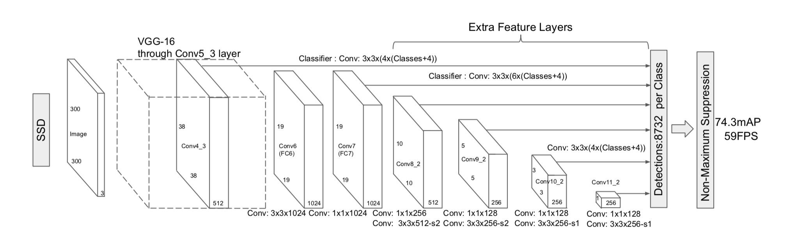

# SSD 网络

## 网络概述

SSD 网络是一个兼具精度和运算效率的 one—stage 网络，精度高于 faster-rcnn ，运算速度高于 Yolo 。主要网络结构基于VGG16，从多个特征层提取潜在物体bbox。和传统提供的FPN不同，不将各层直接相加，而是将不同的feature map进行综合，各层分贝检测不同大小的物体。输出分类用每类的confidence，输出回归为bbox的loc（x,y,w,h）。

优点：运算速度快，

缺点：小物体检测效果差（小物体检测使用低特征层，特征提取不足）；default box依赖

设想改进：将FC7的结果反卷积放大回Conv4_3的尺寸在进行检测会不会提高小物体效果

## 网络结构

前半段采用VGG-16网络，再连接数个卷积网络（称为FC层）。利用stride=2的卷积层缩小图像分辨率，每层经过两次卷积后输出一次分类结果。

- FC4_3: (Output: Conv 3x3x(4xClasses+4))
- FC6: Conv 3x3x1024
- FC7: Conv 1x1x1024 (Output: Conv 3x3x(6xClasses+4))
- FC8: Conv 1x1x256 + Conv 3x3x512 stride=2 (Output: Conv 3x3x(6xClasses+4))
- FC9: Conv 1x1x128 + Conv 3x3x256 stride=2 (Output: Conv 3x3x(6xClasses+4))
- FC10: Conv 1x1x128 + Conv 3x3x256 (Output: Conv 3x3x(4xClasses+4))
- FC11: Conv 1x1x128 + Conv 3x3x256 (Output: Conv 3x3x(4xClasses+4))

最终每类的检测个数：38x38x4 + 19x19x6 + 10x10x6 + 5x5x6 + 3x3x4 + 1x1x4 = 8732

对于每个feature map内的像素点，建立多尺度的defalt box（4或6），每个defalt box的位置偏移元素有四个。不同feature map上的defalt box大小也不同，用于识别不同大小的物体。浅层用于识别小物体，scale小，深层用来识别大物体，scale大。defalt box的尺寸和大小由超参数设定。

$$ S_k=S_{min}+\frac{S_{max}-S_{min}}{m-1}(k-1) \quad k\in[1,m] $$
$$ a_r \in \{1,2,3,\frac12,\frac13 \} $$

原文中，$S_{min}=0.2, S_{max}=0.9$。$m$为使用的特征层数量，由低层到高层。因此可以计算每个矩形的大小。

$$ width: w^a_k = s_k\sqrt{a_r} $$
$$ height: h^a_k = s_k/\sqrt{a_r} $$

对于 $a_r=1$，额外添加一个新的大小的box。这样一共可以得到6种box。

$$ s'_k=\sqrt{s_ks_{k+1}} $$

## Training

### Matching Strategy

为了在训练时使用，首先需要找到和Ground Truth匹配的defalt box。之后，为了寻找其他Positive

- 首先找到最匹配的defalt box。原文中使用Jaccard overlap，也就是常用的IOU表示匹配程度。

$$ J(A, B)=\frac{|A \cap B|}{|A \cup B|} $$

- 从其他defalt box中找到IOU大于threshold（0.5）的作为正例，提高系统的识别能力。

### Loss and Training

Loss分为分类（confidence）和定位（Localization）。定位Loss采用faster-rcnn的smooth-1，只计算分为正样本的defalt box的loss。分类Loss采用，Loss正负样本都进行计算。

$$ L(x, c, l, g)=\frac{1}{N}\left(L_{\operatorname{con} f}(x, c)+\alpha L_{l o c}(x, l, g)\right) $$

其中，N代表被归为正例的box个数。

$$ L_{l o c}(x, l, g)=\sum_{i \in P o s}^{N} \sum_{m \in\{c x, c y, w, h\}} x_{i j}^{k} \operatorname{smooth}_{\mathrm{L} 1}\left(l_{i}^{m}-\hat{g}_{j}^{m}\right) $$
$$ \hat{g}_{j}^{c x}=\left(g_{j}^{c x}-d_{i}^{c x}\right) / d_{i}^{w} \quad \hat{g}_{j}^{c y}=\left(g_{j}^{c y}-d_{i}^{c y}\right) / d_{i}^{h} $$
$$ \hat{g}_{j}^{w}=\log \left(\frac{g_{j}^{w}}{d_{i}^{w}}\right) \quad \hat{g}_{j}^{h}=\log \left(\frac{g_{j}^{h}}{d_{i}^{h}}\right) $$
$$ smooth_{L_1} = \left\{\begin{aligned}
&0.5x^2, \qquad if|x|<1\\
&|x|-0.5,\qquad otherwise\\
\end{aligned}\right.$$

$x_{ij} \in [0,1]$表示第i个box是否属于第j个Ground Truth和第k类。$\hat{g}_{j}^{cx}$为预测的x坐标和目标的x坐标差值除以该box的宽；$\hat{g}_{j}^{w}$为实际宽度和预测宽的对数值。

Confidence Loss 采用 multi class softmax。若为正例，计算其对应于所属框的loss；若为负例，取其对分类0（无物体）的对数。

$$ L_{c o n f}(x, c)=-\sum_{i \in P o s}^{N} x_{i j}^{p} \log \left(\hat{c}_{i}^{p}\right)-\sum_{i \in N e g} \log \left(\hat{c}_{i}^{0}\right) \quad \text { where } \quad \hat{c}_{i}^{p}=\frac{\exp \left(c_{i}^{p}\right)}{\sum_{p} \exp \left(c_{i}^{p}\right)} $$

### Hard Negative mining

对于正负样本不均衡的情况，对负样本按照Confidence Loss进行排序，使得正负比例接近1：3.
