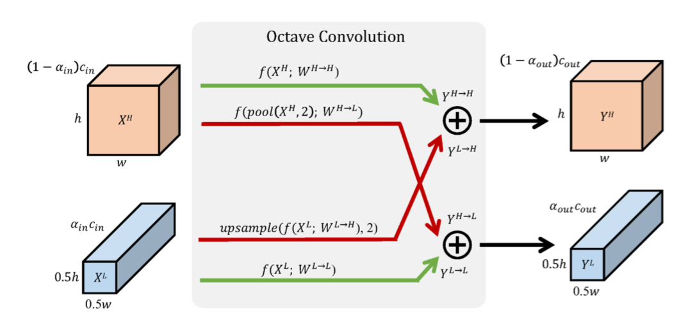

# OctvateConv

Octvate Conv在论文《Drop an Octave: Reducing Spatial Redundancy in Convolutional Neural Networks with Octave Convolution》中提出，用于代替传统卷积，在提升效果的同时节省计算消耗。

## 主要思路

在卷积层中引入高低频的概念，认为每层特征图也都存在高频、低频分量，而低频特征往往是冗余的，因此可以通过节省对低频特征的计算来减少消耗。同时，分配低频和高频信号也相当于在每个卷积层进行了多尺度特征融合，可以提高精度。

模型参数保持一致，计算量减少，效果提升。
