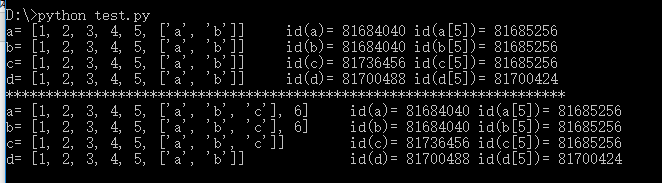

# Python 语法笔记

## 类初始化

```python
class Base():
    def __init__(self, A, B):
        self.A = A
        self.B = B
        c = self.base(A, B)

    def base(self, a, b):
        return a * b

Base(1, 2)
```

## 常见35个python面试题

### 语言特点和优点

- 解释性

	python在运行时不会进行编译，而是逐行运行。源代码会被编译为更低级的一种形式，称之为字节码，即.pyc文件，该文件和CPU的指令集类似，但不会直接被CPU执行，而是在虚拟机执行。

	执行python源文件的程序叫python解释器，CPython就是一个用C编写的解释器，是Python默认的解释器，但如PyPy就是另一种，使用了JIT技术，运行速度更快。
	
	这和 JAVA 不同，当你每次写完 JAVA 代码要执行时，都要手动将其编译为 .class 文件，然后执行。也正是这个原因，JAVA 被称为编译型语言，而 Python 被叫做解释型语言。但事实上，两种语言执行时都会先编译成字节码，然后交给虚拟机执行。
	
	而C类语言，会首先将高级语言转化为CPU可直接执行的机械码，生成一个二进制的可执行文件。

- 动态特性
	- python是动态语言、动态类型语言、强类型语言
		- 动态语言：在运行时可以根据某些条件改变自身结构，可以在运行时引进新的函数、对象甚至代码
		- 动态类型语言：在运行期间检查数据类型，数据类型不是在编译阶段决定，而是在运行阶段
		- 强类型语言：一旦一个变量被指定数据类型，不经过强转换就永远是这个类型
	
	- 动态添加属性
	
		对于一个类，可以为部分对象添加属性，而不改变其他类的该属性；给类添加新的属性，所有对象都会具有该属性

		```python
		class Obj(object):
			def __init__(self):
				self.name = 'MM'

		obj = Obj()
		obj.age = 23
		print(obj.age) # obj拥有age属性
		obj2 = Obj()
		print(obj2.age) # obj2不拥有age属性

		# 当给类直接添加属性，其所有对象都会具有该属性
		Obj.score = 100
		print(obj.score)
		print(obj2.score)
		```

	- 动态添加方法

		类中有三种方法：实例方法，静态方法，类方法

		- 实例方法：绑定在一个对象上，第一个参数默认使用self，会把对象作为第一个参数传递进来
		- 静态方法：使用装饰器@staticmethod定义，类和对象都可以调用，不需要默认参数。可以理解为，静态方法是个独立的、单纯的函数，它仅仅托管于某个类的名称空间中，便于使用和维护。
		- 类方法：使用装饰器@classmethod定义，类和对象都可以调用，第一个参数默认使用cls。原则上，类方法是将类本身作为对象进行操作的方法。假设有个方法，且这个方法在逻辑上采用类本身作为对象来调用更合理，那么这个方法就可以定义为类方法。另外，如果需要继承，也可以定义为类方法。

		```python
		from types import MethodType

		class Obj(object):
			# __slots__ = ('name', 'age')

			def __init__(self):
				self.name = 'MM'

		def set_score(self, score):
			self.score = score

		@staticmethod
		def static_func():
			print('static_func')

		@classmethod
		def class_func(cls):
			print('class_method')

		# 动态添加实例方法
		obj = Obj()
		obj.set_score = MethodType(set_score, obj)
		obj.set_score(99)
		print(obj.score)    # 99
		obj2.set_score(99)    # AttributeError: 'Obj' object has no attribute 'set_score'
		"""
		由以上代码可知，Obj类有一个方法：eat()方法。通过[types.MethodType(方法名, 对象名)]给类对象zhangsan动态添加了对象方法run()，同理，Obj的另一个类对象lisi不能调用这个方法
		注：通过对象名添加的对象方法，只有这个对象能使用
		"""
		# 添加静态方法
		Obj.static_func = static_func
		Obj.static_func()
		obj.static_func()
		obj2.static_func()
		"""
		由以上代码可知，通过[类名.静态方法名]给类Obj动态添加了静态方法static_func()，Obj类的Obj对象和obj2对象都能调用这个方法
		注：通过类名添加的静态方法，这个类及这个类的所有对象都能使用
		"""
		# 添加类方法
		Obj.class_func = class_func
		Obj.class_func()
		obj.class_func()
		obj2.class_func()
		"""
		由以上代码可知，通过[类名.类方法名]给类Obj动态添加了类方法class_func()，Obj类的obj对象和obj2对象都能调用这个方法
		注：通过类名添加的类方法，这个类及这个类的所有对象都能使用
		"""
		```
	
	- __slots__的使用

		在一些场景下，我们只希望限制class可以添加的属性，则可以使用__slots__，只有其中包含的属性才可以被添加

		```python
		class Obj(object):
    		__slots__ = ('name', 'age')

		obj = Obj()
		obj.name = 'zhangyafei'
		obj.age = 23
		obj.score = 99  # AttributeError: 'Obj' object has no attribute 'score'
		Obj.score = 100
		print(obj.score)    # 100
		obj.score = 99  # AttributeError: 'Obj' object attribute 'score' is read-only	
		```

- 面向对象
- 语法简洁
- 开源
- 丰富的资源社区：各种Python Modules，支持完整，安装简单

### 深拷贝和浅拷贝

- 相同点

	两者新拷贝出的新对象的地址和原对象是不一样的，即只改变该对象的结构的话，深拷贝和浅拷贝一样，都不会和原对象产生干扰

- 不同点

	浅拷贝和深拷贝的区别主要体现在复制的可变元素（如列表、字典）中的差异。深拷贝会同时拷贝该对象内的可变元素，新创建一个地址保存，而浅拷贝仍指向原可变元素地址。因此浅拷贝出的对象，当原对象改变可变元素时，新对象会随着一起改变。

<div align=center>

</div>

### 列表和元组

主要区别在于列表可变，而元组不可变。此处需注意List使用时的清零问题，因为List一般采用append的方式添加，如忘记清零会导致内存爆炸、结果错误等，此时可考虑使用元组。

### 三元表达式

```python
a = 1
b = 1 if a == 1 else 2
```

### 类的继承

一个类继承自另一个类，也可以说是一个孩子类/派生类/子类，继承自父类/基类/超类，同时获取所有的类成员（属性和方法）。继承使我们可以重用代码，并且还可以更方便地创建和维护代码。

- 单继承- 一个子类类继承自单个基类
- 多重继承- 一个子类继承自多个基类
- 多级继承- 一个子类继承自一个基类，而基类继承自另一个基类
- 分层继承- 多个子类继承自同一个基类
- 混合继承- 两种或两种以上继承类型的组合

### 实现多线程

线程是轻量级的进程，多线程允许一次执行多个线程。众所周知，Python 是一种多线程语言，它有一个多线程包。
GIL（全局解释器锁）确保一次执行单个线程。一个线程保存 GIL 并在将其传递给下一个线程之前执行一些操作，这就产生了并行执行的错觉。但实际上，只是线程轮流在 CPU 上。当然，所有传递都会增加执行的开销。

### 大小写转换

使用lower()和upper()进行转换

```python
'aBc'.lower() # ‘abc'
'aBc'.upper() # 'ABC'
'aBc'.islower() # False
'ABC'.isupper() # True
```

### Pass语句

在写代码时，可能出现只写了函数声明而没想好函数怎么写，为了保证语法检查的正确必须加入一些东西，此时就会加入Pass

### 不同进制表示

```python
'0b1111' # 二进制
'0o10' # 八进制
'0x10' # 十六进制
```

### 获取字典中的所有键

用dict.keys()查看

### join()和split()

```python
a = 'abc.jpg'
b = a.split('.') # ['abc', 'jpg']

c = ('+')
d = ('1', '2', '3')
e = c.join(d) # '1+2+3'
```

### 内存释放

当python程序中止时，不会释放全部内存，
