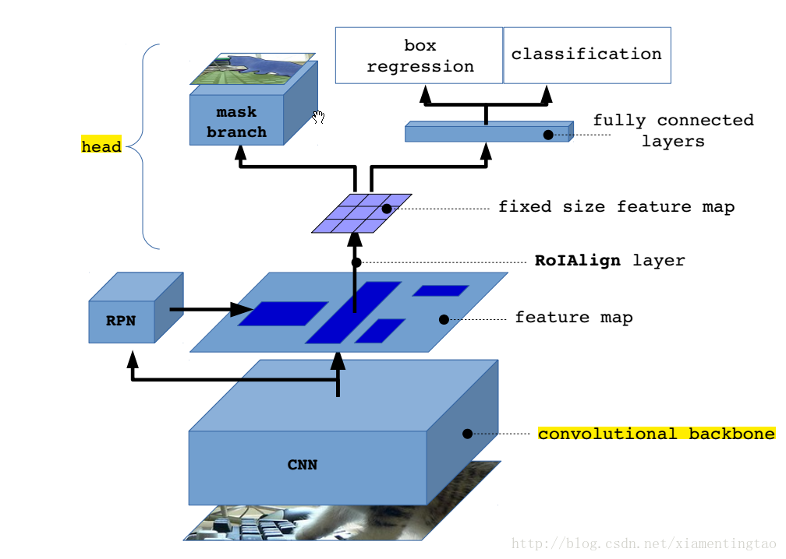
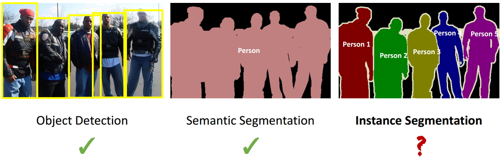

# Mask RCNN
Mask RCNN 是基于 Faster RCNN 提出的框架，完成了 objeect instance segmentation。有效地同时完成了高质量的语义分割，扩展一个分支使用现有的检测对目标进行预测，速度达到5fps。

##Mask RCNN的主要贡献
- 使用 RexNet + FPN 的 CNN 结构，达到 State-of-the-art 的效果。
- 用 RoI Aligin 代替 RoI Polling，解决 Misalignment 的问题
- 更合理的 Loss Function
- 在 box regression 和 classification 分支的基础上，加入 mask branch 使得网络能够接进行 Instance Segmentiation
 --------

**Difference between Instance segmentation and Semantic segmentation**

---------
### RoI Align
RoI Aligin 是对 RoI Pooling 方法的改进。在 Faster RCNN 中， RoI Pooling 采用了简单粗暴的四舍五入的方法，导致 7x7 的 bin 中，每部分面积不相同