# 面试准备计划

## 复习内容

- 代码能力
  - tensorflow、keras、pytorch
  - pandas、numpy 数据处理
  - python 基本语法
  - leetcode 算法题

- 知识储备
  - 机器学习基础
    - 多层感知机 ：小蓝书只有感知机推导，多层感知机见花书、西瓜书
    - K 临近搜索
    - 支持向量机
    - 神经网络
    - 随机森林
    - 隐马尔科夫
    - 条件随机场
  - 图像算法
    - 深度学习框架
    - 传统图像处理
  - 经典书籍
    - 花书
    - 小蓝书 ：完成 1-2 章
    - 剑指 offer

- 实习内容
  - 深圳实习：deeplab v3的使用
  - 机械臂算法：AlexNet 的使用

## Daily Report

### 2019.3.7

#### tensorflow

- linear regression:
  
    ```python
    X = tf.placeholder("float")
    Y = tf.placeholder("float")

    W = tf.Variable(np.random.randn())
    b = tf.Variable(np.random.randn())
    ```

  在tensorflow定义中，流动的输入输出数据用placeholder定义，系统中需要更新的参数用Variable。预设时可以不设定具体的tensor尺寸，包括参数定义时，可以不定义numpy的随机变量生成的尺寸，可见tensorflow对numpy有很好的支持。

### 2019.4.22

- **torchsummary**

    实用的pytorch网络结构显示插件

    ``` python
    model = resnet()
    torchsummary.summary(model, (1, 256, 256))
    ```

- **resnet**

    记得计算输出的尺寸，保证最后一层每个特征图尺寸为1

### 2019.4.26

- **1x1 conv**

    1x1卷积核具有三个作用：打通特征图之间的关系、改变特征图层数（减少数据量）、解决输入图像需要固定尺寸的问题

    1. 降低训练参数

        在ResNet的BottNeck结构中，通过256x1x1x64的卷积层，将特征图减少到64层，后进行64x3x3x64的卷积，之后再通过64x1x1x256回到256层，有效减少参数量

    2. 实现跨通道的交互与信息融合

        传统的卷积层中每个滤波器需要同时映射跨通道和空间维度的相关性，包含2个空间维度信息（图像的长和宽）和一个通道维度信息。因此研究者考虑可以将传统的卷积层操作分离开来，分别从空间维度和通道维度提取特征。

        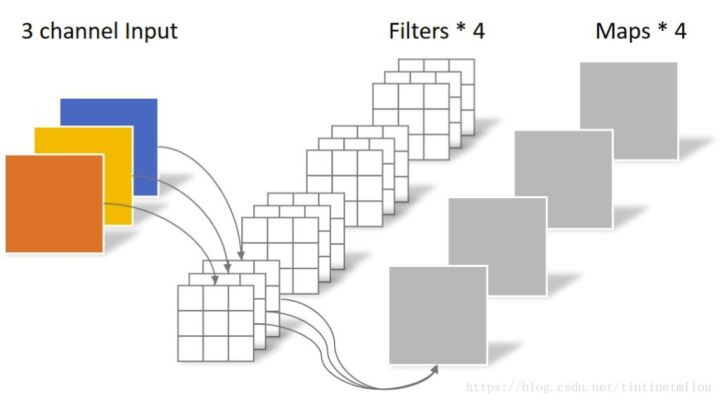

        Extreme Inception module首先使用一个1x1卷积核映射跨通道相关性，然后分别映射每一个输出通道的空间相关性，而Xception module则使用一种深度可分卷积运算，首先提取每个通道上的空间相关性（depthwise convolution），然后再经过1x1卷积核获取跨通道的相关性（pointwise convolution）。

        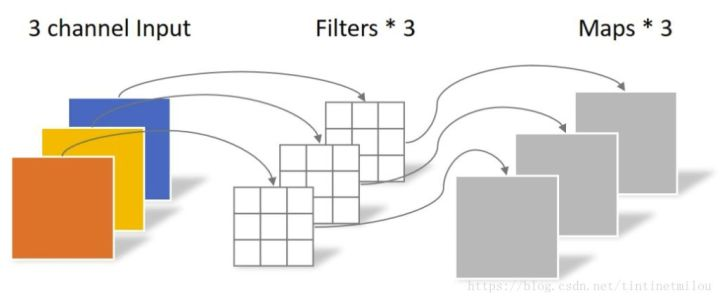
        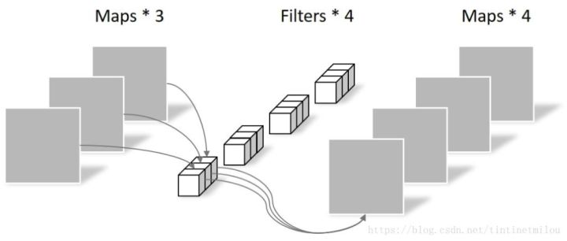

- **GAP**

    全局平均池化（Global Average Pooling）用于代替FC层输出分类，在保持精确性几乎不变的前提下压缩参数量

    思路：在最后一层生成n个卷积层，n为输出分类数量。对每个卷积层参数取平均，作为结果进行softmax后输出。

    缺陷：可能导致收敛速度变慢，在反向传播梯度时，前层的每个点梯度将变为1/m^2

### 2019.4.27

- **知识蒸馏 knowledge distillation**

    [blog](https://blog.csdn.net/nature553863/article/details/80568658)

    Hinton的文章"Distilling the Knowledge in a Neural Network"首次提出了知识蒸馏（暗知识提取）的概念，通过引入与教师网络（teacher network：复杂、但推理性能优越）相关的软目标（soft-target）作为total loss的一部分，以诱导学生网络（student network：精简、低复杂度）的训练，实现知识迁移（knowledge transfer）。

    通过提出的 soft target 辅助 hard target 进行训练，因为 hard target 虽然绝对正确，但包含信息量很低，而 soft target 包含信息量大。（比如同时分类驴和马的时候，尽管某张图片是马，但是soft target就不会像hard target 那样只有马的index处的值为1，其余为0，而是在驴的部分也会有概率）

    这样的好处是，这个图像可能更像驴，而不会去像汽车或者狗之类的，而这样的soft信息存在于概率中，以及label之间的高低相似性都存在于soft target中。但是如果soft targe是像这样的信息[0.98 0.01 0.01]，就意义不大了，所以需要在softmax中增加温度参数T（这个设置在最终训练完之后的推理中是不需要的）

    $$ q_i = \frac{exp(z_i/T)}{\sum\limits_{j}\exp(z_j/T)} $$
    $$ L = \alpha L^{(soft)}+(1-\alpha)L^{(hard)} $$

    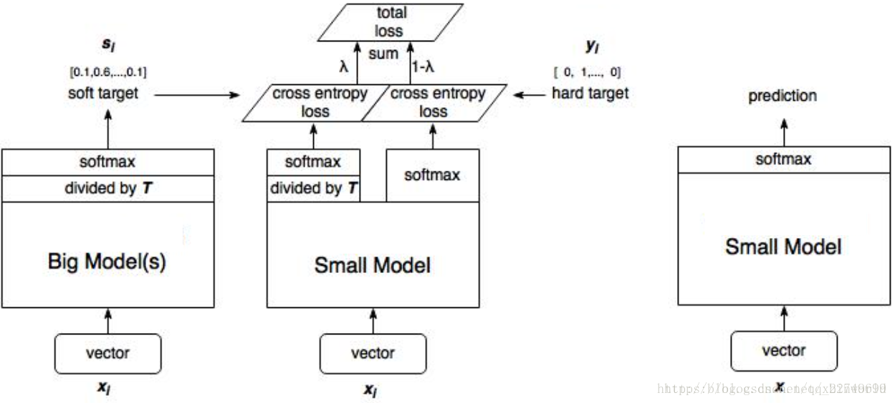

### 2019.4.29

- **Pytorch Styleguide**
  
  [GithubLink](https://github.com/IgorSusmelj/pytorch-styleguide)

  1. 常用程序库

        prefetch_generator: Loading next batch in background during computation

        tqdm: Progress during training of each epoch

  2. 文件组织

        不要将所有的层和模型放在同一个文件中。最好的做法是将最终的网络分离到独立的文件（networks.py）中，并将层、损失函数以及各种操作保存在各自的文件中（layers.py，losses.py，ops.py）。最终得到的模型（由一个或多个网络组成）应该用该模型的名称命名（例如，yolov3.py，DCGAN.py），且引用各个模块。

- **Smooth L1**

    用于图像检测问题的 Loss 结构，最早在 Fast RCNN 中提出，负责对回归框的位置误差进行评价。

    $$ \lambda\frac{1}{N_{reg}}\sum\limits_ip_i^*L_{reg}(t_i,\:t_i^*) $$

  - $i$ ： mini-batch 的 anchor 的索引。
  - $pi$：目标的预测概率。
  - $pi^∗$：target二分类是否有物体，有物体为1，否则为0。
  - $ti$：一个四点向量，预测坐标
  - $ti^∗$：是一个四点向量，是ground truth boungding box的坐标（真实坐标）
    $$ smooth_{L_1} = \left\{\begin{aligned}
    &0.5x^2, \qquad if|x|<1\\
    &|x|-0.5,\qquad otherwise\\
    \end{aligned}\right.$$

### 2019.4.30

- **Yolo V3**

    Yolo 检测速度快，但对于小物体效果比较差。

### 2019.5.3

- **pytorch loss function** [link](https://blog.csdn.net/zhangxb35/article/details/72464152?utm_source=itdadao&utm_medium=referral)

    对pytorch而言，很多 Loss 都有 size_average 和 reduce 两个参数。reduce为False，直接返回向量形式的Loss；reduce为True，size_average为True，返回平均自，否则返回之和。

    ```python
    loss_fn = torch.nn.L1Loss(reduce=True, size_average=True)
    loss_fn = torch.nn.SmoothL1Loss()
    loss_fn = torch.nn.MSELoss()
    ```

  - nn.L1loss
  
    $$ loss(x_i, y_i) = |x_i-y_i| $$

  - nn.SmoothL1Loss

    $$ loss(x_i,y_i)=\left\{\begin{aligned}
        &0.5(x_i-y_i)^2 \qquad if|x_i-y_i| < 1\\
        &|x_i-y_i|-0.5 \qquad otherwise\\
    \end{aligned}\right.$$

  - nn.MSELoss

    $$ loss(x_i,y_i)=(x_i-y_i)^2 $$

  - nn.BCELoss

    二分类的交叉熵函数，使用时需要在输入前加sigmoid。

    $$ loss(x_i,y_i)=-w_i[y_ilogx_i+(1-y_i)log(1-x_i)] $$

    式中，$w_i$表示当前样本的loss权重。对于正负样本不均衡的情况，需要设置来进行平衡

    ```python
    import torch.nn.functional as F
    loss_fn = torch.nn.BCELoss()
    input_data = Variable(torch.randn(3, 4))
    # 虽然只有0，1两种，但torch要求使用torch.FloatTensor格式
    target = Variable(torch.FloatTensor(3, 4).random_(2))
    # 此处需要对input做sigmoid运算
    loss = loss_fn(F.sigmoid(input_data), target)
    ```

  - nn.BCEWithLogitsLoss

    将BCE和Sigmoid结合，省去一个步骤。经过Sigmoid处理后，数值结果更加稳定，建议使用，性能更好。

    ```python
    import torch.nn.functional as F
    loss_fn = torch.nn.BCELossWithLogitsLoss()
    input_data = Variable(torch.randn(3, 4))
    # 虽然只有0，1两种，但torch要求使用torch.FloatTensor格式
    target = Variable(torch.FloatTensor(3, 4).random_(2))
    # 此处不需要对input做sigmoid运算
    loss = loss_fn(input_data, target)
    ```

  - nn.CrossEntropyLoss

    对于多分类问题设计的Loss Function，*当简化为二分类问题时，和logistics回归为同一形式。*

    首先经过一个sigmoid，将输入映射，之后计算交叉熵。由于标签为one hot形式，可以直接对

    $$ {\begin{aligned}
        loss(x, label) & = -w_{label}log\frac{e^{x_{label}}}{\sum_{j=1}^Ne^x_j} \\
        & = w_{label}(log\sum^N_{j=1}e^x_j-x^{label})
    \end{aligned}}$$

- **激活函数**
  
    主要包括：sigmoid，softmax，relu

  - relu

    优点：求导简单，配合SGD下降速度快，梯度稳定，解决梯度爆炸和梯度消失问题

    缺点：导数不连续，可能出现 dead relu 现象

    - dead relu

        dead relu，指当输入小于零时，输出为零，反向传播时没有梯度，节点无法更新，保持为零。

        解决方法：
          1. 降低学习率（最本质）
          2. 使用L2正则化，或其他优化器（Adam）
          3. 优化的relu，如：Leaky ReLU

    - Leaky ReLU

        $$ ReLU = max(0, x)\\
           Leaky \ ReLU = max(\lambda x, x) \qquad \lambda < 1 $$

        由于在小于0的位置，也会有梯度，可以较好地解决 dead relu 问题

### 2019.5.5

#### 目标检测评价标准

Precision, Recall, Accuracy 最早是信息检索领域常用的评价标准。

- Percision / Recall
  - True Positive : 预测为真，实际为真
  - True Negative : 预测为假，实际为假
  - False Positive : 预测为真，实际为假
  - False Negative : 预测为假，实际为真

  True、False代表预测结果的对错（和实际值相比），Positive、Negative代表预测的结果

  $$ Precision = \frac{TP}{TP+FP} $$
  $$ Recall = \frac{TP}{TP+FN} $$
  $$ Accuracy = \frac{TP+TN}{N} $$

  Precision代表精确率，分类为正的样本中多少是正确的，Recall代表召回率，表示真实为正的样本有多少被找到。在实际应用中，Precision的意义是表示提供给用户的数据中，多少是有价值的。
  
  两者成对出现，单独使用无法有效判断系统效果，尤其是数据之间极不均衡时。假设数据中99.9%为正例，只需全部预测为正，就可以获得极高的精确率，但系统无效。

  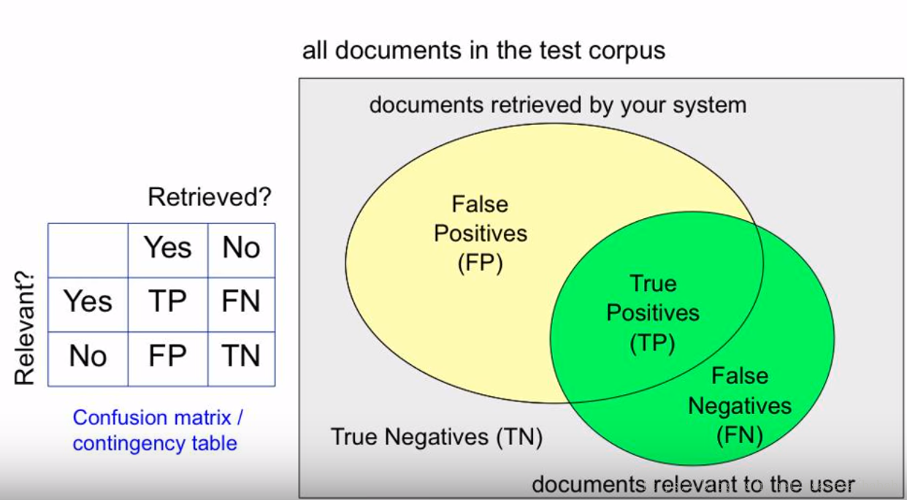

- F Score

  为解决此类问题，F Score综合两个性能指标。其中，$\beta$用于调和P和R的群众，一般取1。F Score即为P和R的调和平均。

  $$ F Score = \frac{(\beta^2+1)PR}{\beta^2P+R} $$

- Precision and Recall Over Ranks
  
  对于有序表，F Score不能很好地表示。因为给出信息的序列也反应系统的性能，即能不能把相关的正确信息尽可能排在序列靠前的位置。

  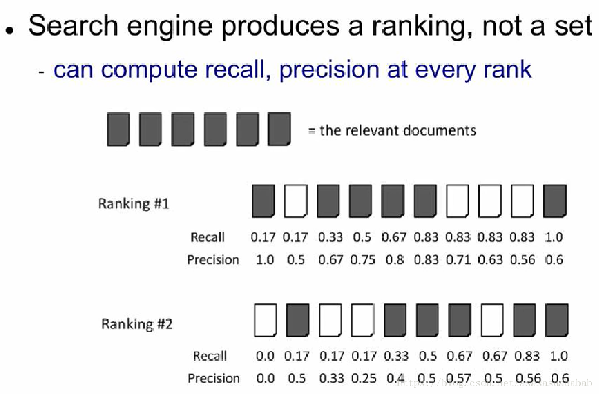

  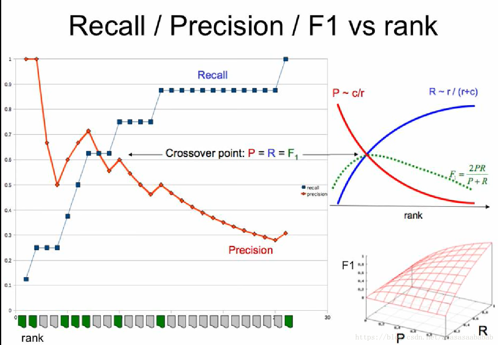

  如上图，首先计算每个元素的precision和recall，即该元素及之前的元素对应的。这样，就可以根据precision和recall随序列的变化进行带序列的分析。如此我们便可以画出Recall-Precision的关系，以及F1的结果。一般来说，F1 Score会在Recall-Precision相交的地方达到最大值，但是这也不一定。毕竟这个极值其实还是需要满足一定的条件的。但是整体趋势就如同右上的那个小图那样子。

  由于曲线不是一个函数，当需要求某个Recall对应的Precision时，采用取“该点右侧第一个最高的Precision”的策略，如图所示。这里也就是在recall大于要求值之后第一次正确输出时对应的Precision。之后可通过插值，绘制Precision和Recall函数，并进行性能分析。12

  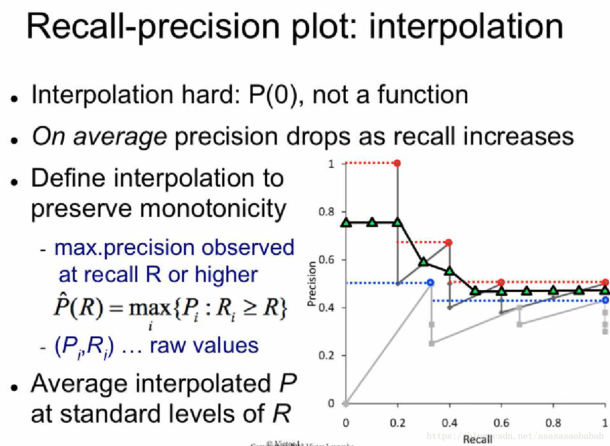
  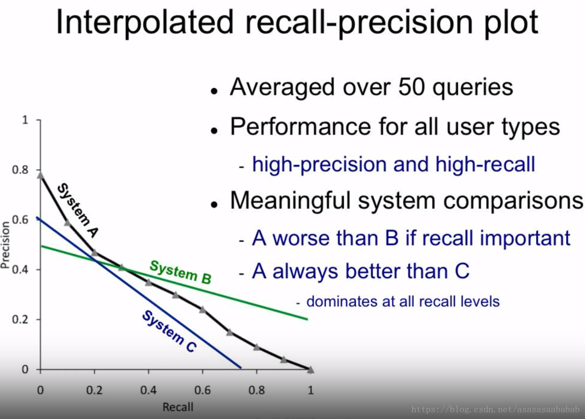

- Mean Average Precision

  对于Qurey，可以简单理解为平均的Precision。此处只计算结果正确是的Precision。

  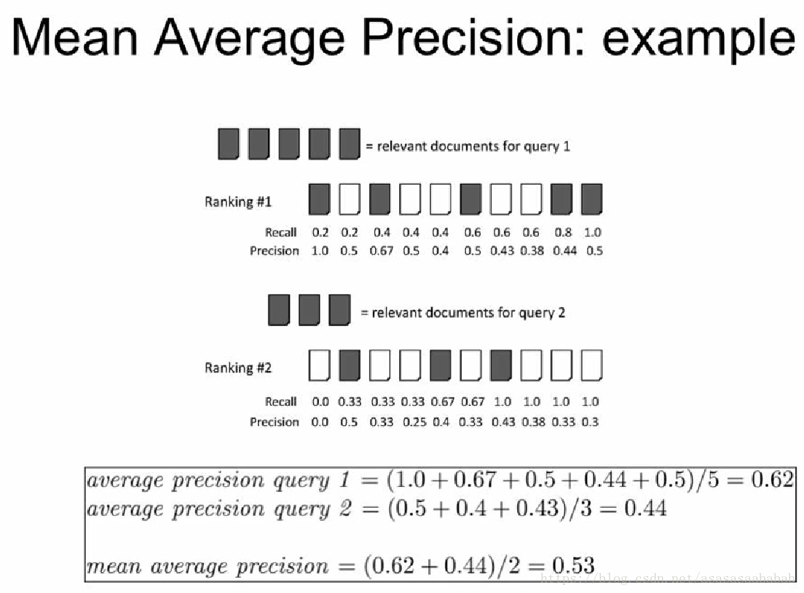

  对于目标检测，采用Precision-Recall曲线下的面积来表示，通常，越好的分类器，AP值越高.多类别采用对各类目标取平均，

  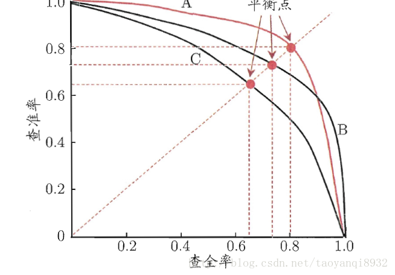

### 2019.5.6

#### SSD代码细节

- relu（inplace=True）
  
  inplace表示直接在之前的数据上，而不储存中间变量，节省内存。

  ```python
  # inplace = True
  x = x + 5
  # inplace = False
  y = x + 5
  x = y
  ```

- nn.conv2d(bias=False)

    Resnet的所有卷积层都不带bias

### 2019.5.7

#### GIOU Loss [link](https://arxiv.org/abs/1902.09630)

现有目标检测的Loss普遍采用预测bbox与ground truth bbox的1-范数，2-范数来作为loss。但是评测的时候却又采用IOU来判断是否检测到目标。显然二者有一个Gap，即loss低不代表IOU就一定小。

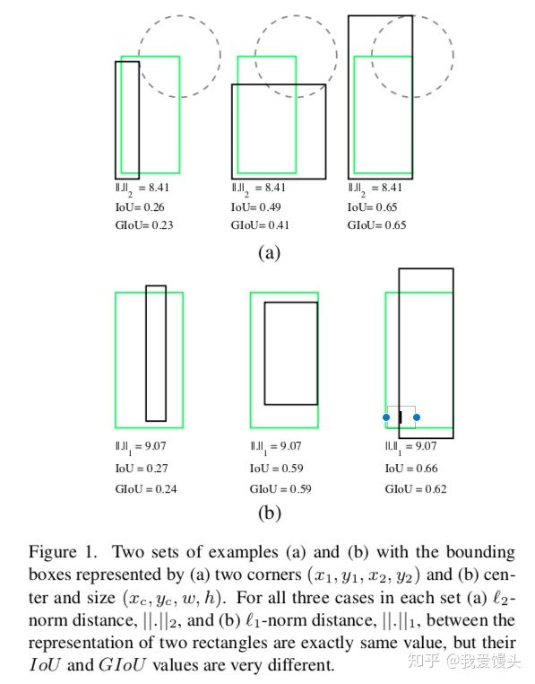

- 主要思路

  对于两个bbox A B，计算能包围A、B的最小包围框C。则

  $$ GIOU = IOU - \frac{C-(A\cup B)}{C} $$

  GIOU计算简单，从结构来看具有以下特点

  - GIOU 是 IOU 的下界，取值范围为 $(-1, 1]$ ,当两个框不重合，不管相聚多远 IOU 都是0，但 GIOU 会在 $(-1, 0)$ 之间变化。

- 实验结果

  对 Yolo 提升在 2% 左右，mask rcnn较少，可能是因为 Mask RCNN 中无法重合的情况较少。

### 2019.5.9

#### Lottery Ticket Hypothesis

### 2019.5.14

#### AP50

除了最常用的AP和mAP，目标检测评价中还经常出现诸如$AP_50$,$AP_70$之类的评价指标，这些指的是取detector的IoU阈值大于0.5、0.7等。阈值越大，检测精确度越高，也越难。

### 2019.6.1

#### collections

collections是python内建的一个结合模块，提供了许多集合类。

- namedtuple

  用来建立带名字的tuple，适用于没必要建立Class而有需要命名的情况。既具备tuple的不变性，又可以根据属性索引。

  ```python
  from collections import namedtuple

  Point = namedtuple('Point', ['x', 'y'])
  p = Point(1, 2)
  print(p.x) # 1
  print(p.y) # 2

  isinstance(p, Point) # True
  isinstance(p, tuple) # True
  ```

- deque

  对list的增强，除了支持append和pop，加入appendleft和popleft，能够从头部添加或删除。

  ```python
  from collections import deque

  q = deque(['a','b','c'])
  q.appendleft('x') # ['x', 'a', 'b', 'c']
  q.popleft('x') # x
  ```

- defaultdict

  使用dict时，引用不存在的key会输出`keyerror`，而defaultdict可以返回一个默认值

  ```python
  from collections import defaultdict

  dd = defaultdict(lambda: 'N/A')
  dd['1']  # N/A
  ```

- OrderedDict

  会按照key定义的顺序插入，而不是key的名称。可以依次实现一个先进先出的dict，固定容量。

  ```python
  from collections import OrderdDict

  class LastUpdatedOrderedDict(OrderedDict):

      def __init__(self, capacity):
          super(LastUpdateOrderedDict, self).__init__()
          self._capacity = capacirty

      def __setitem__(self, key, value):
          containsKey = 1 if key in self else 0:
          if len(self) - containKey >= self._capacity:
              last = self.popitem(last=False)
              print('remove', last)
          if containKey:
              del self[key]
              print('set:', (key, value))
          else:
              print('add:', (key, value))
          OrderedDict.__setitem__(self, key, value)
  ```

- Counter

  Counter是一个简单计数器，用于统计字符出现次数。Count本身是dict的一个子类，对于未出现过得字符，会自动生成key，因此更加方便

  ```python
  from collections import Counter

  c = Counter()
  for ch in 'mowenhao':
    c[ch] += 1
  ```
  